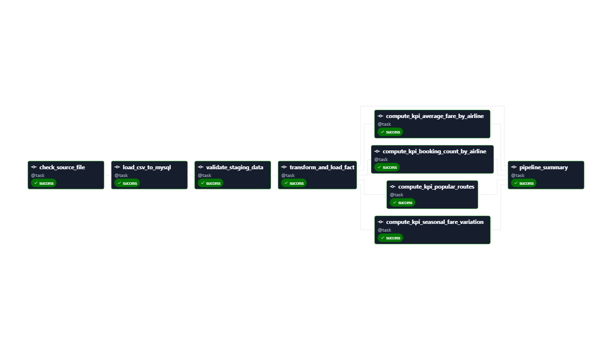

# Airflow Flight Price Analysis — Bangladesh

An end-to-end batch pipeline, orchestrated with Apache Airflow and running
entirely in Docker. It ingests raw Bangladesh flight price data, stages it in
MySQL, validates and enriches it, computes four KPIs, and loads the results into
PostgreSQL for analysis.

```
CSV (57,000 rows)
  -> MySQL staging          raw load, unmodified
  -> validation             every row labelled valid / invalid + reason
  -> transformation         cleaning + enrichment of the valid rows
  -> PostgreSQL analytics   fact table, then four KPI tables
```

Stack: Docker Compose, Airflow 3.3 (LocalExecutor), MySQL 8, PostgreSQL 16,
Python 3.12 with pandas and SQLAlchemy. Nothing is installed on the host.

## 1. Repository Layout

```
dags/flight_price_pipeline.py   The DAG — orchestration only
src/config/settings.py          All configuration in one place
src/ingestion/csv_loader.py     CSV -> MySQL staging
src/validation/validators.py    Schema / null / numeric / business rules
src/transformation/…            Cleaning + enrichment
src/kpi/metrics.py              The four KPIs
src/database/{mysql,postgres}   Engine + table helpers
sql/mysql/                      Staging DDL (auto-applied) + inspection queries
sql/postgres/                   Analytics DDL (auto-applied) + analytical queries
data/raw/                       Put the source CSV here
data/processed/                 data_quality_report.json per run (gitignored)
tests/                          Unit tests over the pure logic in src/
docs/                           The written report
Dockerfile, docker-compose.yml  The whole stack
```

**Full write-up: [`docs/flight-price-pipeline-report.md`](docs/flight-price-pipeline-report.md)**
— architecture and execution flow, every task, KPI definitions with results, and the
challenges encountered and how they were resolved.

The modules under `src/validation`, `src/transformation`, and `src/kpi` are pure
pandas — no Airflow imports, no connections — which is what makes them testable
without a database. Design reasoning for each decision lives in the docstring of
the file that implements it; the pipeline's overall shape is in the DAG docstring,
which Airflow renders on the DAG's page in the UI.

## 2. Quick Start

Requires **Docker Engine 24+**

```bash
cp .env.example .env      # then set the passwords and generate the two Airflow keys
```

`.env.example` documents every variable inline, including how to generate
`AIRFLOW_FERNET_KEY` and `AIRFLOW_SECRET_KEY`. Both are intentionally blank 

Place the dataset at `data/raw/Flight_Price_Dataset_of_Bangladesh.csv`, then:

```bash
docker compose build 
docker compose up -d
docker compose ps          # wait for the five long-running services to read "healthy"
```

`airflow-init` is expected to show `Exited (0)` — it is the one-shot migration
step, not a service that stays up.

The first run builds the Airflow image and pulls three database images, so expect
a few minutes; later starts take seconds. The api-server is the slowest to become
healthy — typically a minute or two, reporting `starting` until then, and the
scheduler deliberately waits for it before starting.

Open **http://localhost:8080** and log in with `AIRFLOW_ADMIN_USER` /
`AIRFLOW_ADMIN_PASSWORD` (`admin` / `admin` by default).

```bash
docker compose down        # stop, keep the data
docker compose down -v     # stop and wipe all three databases
docker compose build       # rebuild after editing requirements.txt
```

## 3. The Docker Stack

| Service | Image | Role |
|---|---|---|
| `airflow-meta-db` | `postgres:16-alpine` | Airflow's own metadata (DAG runs, task state) |
| `mysql` | `mysql:8.0` | Staging — raw ingested CSV rows |
| `postgres` | `postgres:16-alpine` | Analytics — fact table + KPI tables |
| `airflow-init` | built locally | One-shot `db migrate` + admin user |
| `airflow-apiserver` | built locally | UI, REST API, and Task Execution API on port 8080 |
| `airflow-scheduler` | built locally | Schedules and, under LocalExecutor, executes the tasks |
| `airflow-dag-processor` | built locally | Parses `dags/` into serialised DAGs |

Pipeline



## 4. Running the Pipeline

Trigger from the UI, or from the command line:

```bash
docker compose exec airflow-scheduler airflow dags trigger flight_price_pipeline

# or run it start-to-finish in the foreground, which is easier to watch
docker compose exec airflow-scheduler airflow dags test flight_price_pipeline
```

## 5. Pipeline Tasks

Nine tasks. Each is a thin wrapper that opens a connection, calls into `src/`, and
logs the outcome.

| Task | What it does |
|---|---|
| `check_source_file` | Confirms the CSV exists and is non-empty, naming the path checked |
| `load_csv_to_mysql` | Truncates staging, loads in 10k-row chunks, then reads the count back and fails on a mismatch |
| `validate_staging_data` | Labels every row `is_valid` + `validation_errors`, writes the quality report, fails if under 95% valid |
| `transform_and_load_fact` | Cleans and enriches the valid rows, replaces `flight_prices` |
| four `compute_kpi_*` tasks | One per KPI, in parallel, each replacing its own table |
| `pipeline_summary` | Re-reads every row count from the database as an independent check |


## 6. Inspecting the Results

Open a shell against either database without installing a client:

```bash
docker compose exec mysql mysql -u flight_user_msql -p flight_staging
docker compose exec postgres psql -U flight_user_pgsql -d flight_analytics
```


Ready-made queries, rather than repeating them here:

- `sql/mysql/validation_queries.sql` — which rows were flagged and why, fare
  reconciliation across the whole table, per-airline validity.
- `sql/postgres/analytics_queries.sql` — the four KPI tables, the effect of the
  fare uplift per airline, peak premium by airline, booking lead time, route
  fare spreads, and load sanity checks.

## 7. Testing
Run 
```bash
docker compose exec airflow-scheduler pytest tests/ -v
```

21 tests over the pure logic in `src/validation`, `src/transformation`, and
`src/kpi`, 

## 8. Troubleshooting

| Symptom | Cause and fix |
|---|---|
| `check_source_file` fails | CSV not at `data/raw/…`. Place it there — no restart needed, `data/` is bind-mounted |
| A table is missing | Init DDL runs only on a database's *first* startup, so a later edit to `sql/` was never applied: `docker compose down -v && docker compose up -d` |
| `airflow-apiserver` sits at `starting`, then restarts | It missed its startup deadline — each worker loads the full DAG bag. Compose already lowers the worker count and raises the timeout; if it persists, give Docker more resources or set `AIRFLOW__API__WORKERS: "1"` |
| The DAG never appears in the UI, and `airflow dags list` is empty | `airflow-dag-processor` is not running. Airflow 3 parses DAGs in that separate service, so the scheduler alone will never register one: `docker compose up -d airflow-dag-processor` |
| `Internal Server Error` in the browser right after upgrading from Airflow 2, while `curl http://localhost:8080/` still returns 200 | Stale server-side session rows. The Airflow 2 sessions in the metadata `session` table cannot be deserialised by Airflow 3's FAB provider (`msgspec.DecodeError: MessagePack data is malformed`), and because `AIRFLOW_SECRET_KEY` is unchanged the old browser cookie still validates and points straight at one. The React shell at `/` loads regardless, so only the login route fails. Clear them — it logs everyone out and touches no pipeline data: `docker compose exec airflow-meta-db psql -U airflow -d airflow -c "DELETE FROM session;"`, then hard-refresh the browser |
| After upgrading from the Airflow 2 stack, port 8080 is taken and `docker compose down` did not free it | The old `airflow-webserver` container is an orphan — that service no longer exists in this compose file, so Compose stopped tracking it. `docker compose down --remove-orphans` |
| Port 8080 / 3307 / 5433 in use | Change `AIRFLOW_WEB_PORT`, `MYSQL_PORT`, or `POSTGRES_PORT` in `.env`, then `docker compose up -d` |
| Connection refused to `mysql` or `postgres` | Inside containers the hosts are the service names; `localhost:3307` / `localhost:5433` work only from the host |
| `validate_staging_data` fails the DAG | Valid-row ratio under 95%. Read `data/processed/data_quality_report.json` — failing here is deliberate, not a bug |
| Tasks stuck in `up_for_retry`, scheduler logged `DAG ... is missing and will be deactivated` | A transient bind-mount read failure made the DAG file look absent, so Airflow dropped the serialized DAG and had nothing left to schedule the retries against. Almost always memory or I/O contention — give Docker more resources, then `docker compose restart airflow-scheduler` and retrigger |
| `DagBag import timeout` | Slow bind-mount reads on macOS/Windows. Compose already raises `dagbag_import_timeout` and the scheduler's parse interval |
| Permission errors on `logs/` (Linux) | Set `AIRFLOW_UID=$(id -u)` in `.env`, then `docker compose up -d` |

