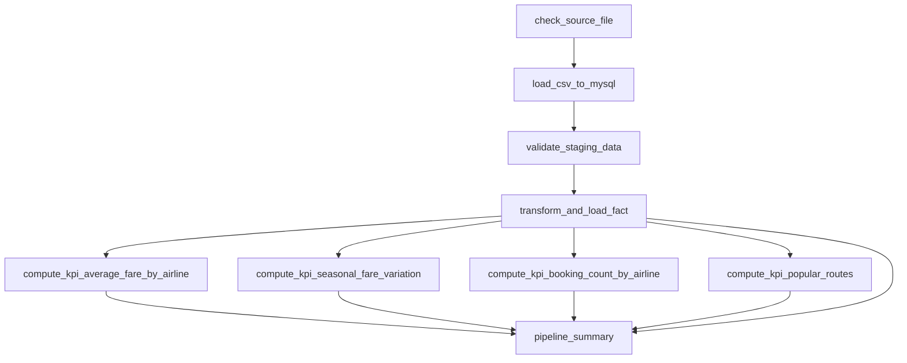

# Flight Price Analysis — Pipeline Report

An Apache Airflow pipeline that ingests Bangladesh flight price data, stages it in
MySQL, validates and enriches it, computes four KPIs, and loads the results into
PostgreSQL. Everything runs in Docker.

| | |
|---|---|
| Source | `Flight_Price_Dataset_of_Bangladesh.csv` — 57,000 rows, 17 columns |
| Staging | MySQL 8 — `stg_flight_prices` |
| Analytics | PostgreSQL 16 — one fact table + four KPI tables |
| Orchestration | Airflow 2.10.5, LocalExecutor, 9 tasks |
| Runtime | Docker Compose, 6 services, nothing installed on the host |
| Data quality | 57,000 / 57,000 rows valid |
| Tests | 21 unit tests over the pure logic in `src/` |

---

## 1. Architecture

Six containers, reproducible from `docker compose up -d`:

| Service | Role |
|---|---|
| `airflow-meta-db` | Airflow's own metadata (DAG runs, task state) |
| `mysql` | Staging — raw ingested rows |
| `postgres` | Analytics — fact table + KPI tables |
| `airflow-init` | One-shot `db migrate` + admin user, then exits |
| `airflow-scheduler` | Executes the DAG |
| `airflow-webserver` | UI on port 8080 |

Four design decisions:

- **Airflow's metadata database is separate from the analytics database.** Combining
  them would be cheaper, but then a schema change or volume wipe on one disturbs the
  other.
- **Schemas create themselves.** The DDL in `sql/` is mounted into each database
  container's `/docker-entrypoint-initdb.d`, which the official images run on first
  startup — so there is no setup script to forget. Trade-off: editing the DDL later
  needs `docker compose down -v`.
- **Connections come from the environment.** `mysql_staging` and
  `postgres_analytics` are injected as `AIRFLOW_CONN_*` variables, so there is no
  bootstrap step and no credentials stored in a volume.
- **Code is bind-mounted.** Editing a module takes effect without a rebuild; only
  `requirements.txt` changes need one.

The DAG holds orchestration only. The validation, transformation, and KPI modules
are pure pandas — no Airflow imports, no connections — which is why the unit tests
run without a scheduler or a database.

---

## 2. Execution Flow



Four stages in sequence, then the four KPIs in parallel, then a verification task.

- **Handoff is a database table, not XCom.** At 57,000 rows, XCom would serialise the
  whole dataset into Airflow's metadata database at every stage. Each task reads what
  the previous one wrote; XCom carries only summary dictionaries. Every intermediate
  result therefore stays queryable after the run.
- **Idempotency.** Every load truncates its target inside the same transaction as the
  insert, so a rerun replaces rather than appends, and a mid-load failure rolls back
  instead of leaving a half-written table. `max_active_runs=1` prevents a second run
  truncating tables the first is reading.

---

## 3. The Tasks

| Task | What it does |
|---|---|
| `check_source_file` | Confirms the CSV exists and is non-empty, naming the path checked |
| `load_csv_to_mysql` | Truncates staging, loads in 10,000-row chunks, then reads the count back and fails on a mismatch. No cleaning — staging stays a faithful copy of the source |
| `validate_staging_data` | Labels every row `is_valid` + `validation_errors`, writes the quality report, then enforces the 95% threshold |
| `transform_and_load_fact` | Reads only valid rows (`WHERE is_valid = 1`), cleans and enriches them, replaces `flight_prices` |
| `compute_kpi_average_fare_by_airline` | KPI 1 |
| `compute_kpi_seasonal_fare_variation` | KPI 2 |
| `compute_kpi_booking_count_by_airline` | KPI 3 |
| `compute_kpi_popular_routes` | KPI 4 |
| `pipeline_summary` | Re-reads every row count from the database as an independent check |

The KPIs are separate tasks so one failing KPI shows as one red task rather than an
opaque failure of a combined step.

---

## 4. Validation

**Validation labels rows; it does not delete them.** Each row gets an `is_valid` flag
and a readable `validation_errors` string written back to staging, so a flagged row
stays queryable with its reason attached. Exclusion happens later and visibly, in the
transformation stage. Errors accumulate — a row failing three rules reports all three.

Rules applied: required columns present; no nulls in the six required fields; fare
and duration fields parse as numbers; no negative fares; airline, source and
destination non-blank; location codes match `^[A-Z]{3}$`; source ≠ destination;
arrival not before departure; duration > 0; lead time ≥ 0; and fare arithmetic
(see §6).

**All 57,000 rows passed.** No nulls, no duplicates, no negative fares, and every
location code is a well-formed IATA code.

If fewer than 95% of rows were valid the DAG fails deliberately — loading an
unrepresentative fraction would produce KPIs that look plausible and are wrong.

---

## 5. KPI Definitions and Results

**Grain: one row is one booking.** The source has no booking identifier and no
quantity column, so one row is one fare quote, and every count is a row count.

### KPI 1 — Average Fare by Airline

`mean(total_fare_bdt)` grouped by `airline`, with min/max for spread.

Top three: Turkish Airlines 75,547 · AirAsia 74,534 · Cathay Pacific 73,325.

The top six carriers span only 72,504 to 75,547 — about 4%. Fares here are driven far
more by route, class, and season than by carrier.

### KPI 2 — Seasonal Fare Variation

`mean(total_fare_bdt)` grouped by `seasonality`, each season expressed against the
non-peak `Regular` baseline:

```
variation_vs_baseline_pct = (season_avg - regular_avg) / regular_avg × 100
```

| Season | Peak | Avg total fare | Flights | vs. Regular |
|---|---|---|---|---|
| Hajj | yes | 97,144 | 942 | **+42.70%** |
| Eid | yes | 91,560 | 603 | **+34.49%** |
| Winter Holidays | yes | 79,677 | 10,930 | **+17.04%** |
| Regular | no | 68,077 | 44,525 | baseline |

The clearest signal in the dataset: all three peak periods carry a substantial
premium, and the premium is largest for the smallest period.

### KPI 3 — Booking Count by Airline

`count(rows)` grouped by `airline`, plus each airline's share of the total — a raw
count only means something against the run's total.

US-Bangla Airlines leads with 4,496 bookings (7.89%), roughly double any other
carrier; the remaining 23 airlines sit near 4% each.

### KPI 4 — Most Popular Routes

`count(rows)` grouped by `route`, ranked descending, top 20 kept with per-route mean
fare. The rank is computed over *every* route before truncating, so rank 1 is the
busiest route overall.

Top three: RJH→SIN 417 bookings · DAC→DXB 413 · BZL→YYZ 410. Volumes are tightly
clustered, so no single corridor dominates.

---

## 6. Key Finding: Fares That Do Not Reconcile

The brief says to calculate `Total Fare = Base Fare + Tax & Surcharge` *"if not
already present"*. On **2,522 rows (4.42%)** the stated total is not that sum. It is
exactly:

```
Total Fare = (Base Fare + Tax & Surcharge) × 1.20
```

The ratio `total / (base + tax)` across those rows has a mean of 1.200000 and a
**standard deviation of 1.17 × 10⁻¹⁶** — floating-point zero. Minimum and maximum are
both 1.200000: the factor is identical on all 2,522 rows. This is a systematic 20%
surcharge, not corrupt data.

The affected rows appear in every cabin class at near-identical rates (Economy and
Business 4.52%, First Class 4.24%) and in all four seasons, though the rate there
varies — 5.04% of Regular rows against 2.01% of Winter Holidays rows.

Applying the brief's formula unconditionally would have overwritten those totals and
**understated 2,522 fares by 20%** — silently, in a pipeline reporting success.

So the pipeline:

1. computes the total **only** where it is missing, never overwriting a stated one;
2. treats these rows as **valid** — a pricing rule is not a data error;
3. flags them in the fact table's `has_fare_uplift` column, since they raise the
   average fare for the airlines carrying them and an analyst must be able to include
   or exclude them knowingly;
4. still flags a total matching *neither* pattern as `fare_mismatch` and excludes it.

Two unit tests guard this behaviour, because a well-meant future "simplification"
would silently corrupt those rows.

---

## 7. Challenges and Resolutions

**Fares that did not reconcile.** 2,522 rows with discrepancies up to 93,164 BDT
looked like corruption. Profiling the *ratio* rather than the difference showed a
constant 1.20 factor, which reframed it as a pricing rule. Handled as in §6.

**Airflow and SQLAlchemy could not both be satisfied.** The image build failed with
`ResolutionImpossible`: `requirements.txt` asked for `SQLAlchemy>=2.0.0` while Airflow
2.10.5 pins `1.4.54`. Airflow 2.x does not support SQLAlchemy 2.0, so the requirement
was wrong — unpinned it and let Airflow's own dependency govern.

**The scheduler was starving the pipeline.** Ingestion crawled while MySQL sat idle,
so the bottleneck was not the database. The scheduler log showed the DAG being
re-parsed every ~40 seconds, with successive parses taking 21.3, 32.8, 46.1 and 57.8
seconds over the Windows bind mount — it was parsing almost without pause. Raising
`min_file_process_interval` to 300 s and
`parsing_processes` to 1 cut the full run from **310 seconds to 81**.

**The webserver would not start.** Repeated `No response from gunicorn master within
120 seconds`. Not a crash: the default four gunicorn workers each load the full DAG
bag, and together they could not finish booting inside gunicorn's startup deadline.
Reduced to two workers and raised the timeouts.

**DAG import timeouts.** `DagBag import timeout after 30.0s`, spent purely reading
bind-mounted module files on a cold parse. Raised `dagbag_import_timeout` to 120 s.

**Writing 57,000 validation results back.** Row-by-row `UPDATE` takes minutes. Replaced
with a bulk insert into a temporary table plus one joined `UPDATE`, which completes in
seconds.

**Schema drift.** After adding `has_fare_uplift` to the DDL, the load failed with
`column ... does not exist` — the init scripts only run on an empty data directory, so
the edit was never applied. Fixed with `docker compose down -v`, and documented in the
README since anyone editing `sql/` will hit it.

**pandas nullable types the driver could not write.** `pd.NA` in nullable `boolean`
and object columns cannot be adapted by psycopg2. Collapsed to plain types at the
boundary: `.astype(bool)`, and `float("nan")` instead of `pd.NA`.

---

## 8. Verification

- Cold start from wiped volumes: all services healthy, schemas created by the init
  mounts.
- Full run: **all 9 tasks succeeded**, 57,000 rows staged and loaded, 2,522 flagged
  `has_fare_uplift`, all four KPI tables populated (24 / 4 / 24 / 20 rows).
- Cross-table consistency: `SUM(booking_count)` = 57,000 = fact table rows.
- **Idempotency**: a second consecutive run produced identical counts.
- 21 unit tests pass; both SQL query files execute clean.

---

## 9. Limitations

- **Batch over a static file** — full truncate and reload, not incremental or
  streaming. Incremental loading would need a natural key or load timestamp the
  source does not have.
- **Seasonality comes from the source column.** If a future dataset drops it, the
  seasonal KPI needs a new documented proxy; inventing one now would make the +42.70%
  Hajj premium unauditable.
- **One row is one booking**, forced by the missing booking identifier. If the source
  later separates quotes from confirmed bookings, both count KPIs change meaning.
